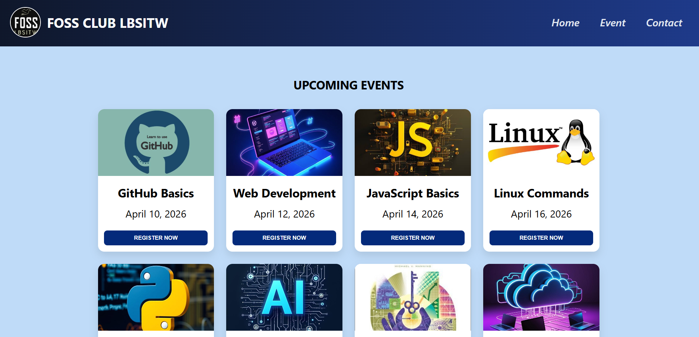
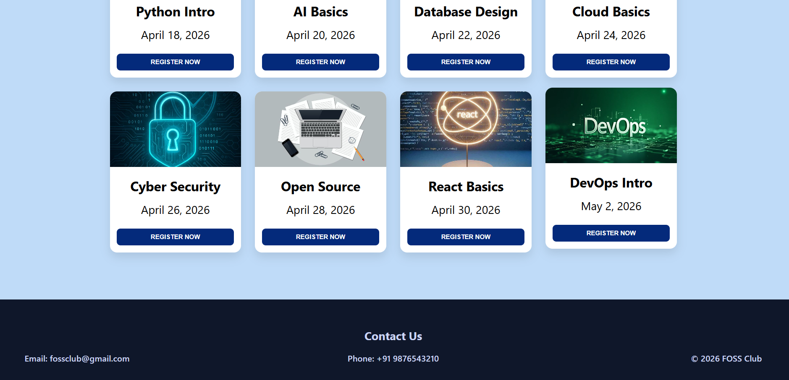
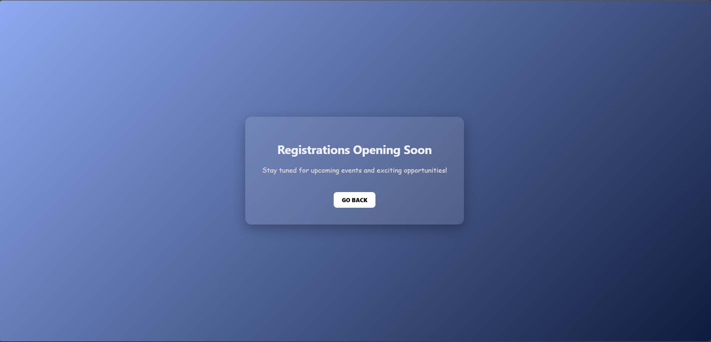

# FOSS CLUB LBSITW - Event Website

A simple and responsive event website created for showcasing upcoming technical events conducted by FOSS Club.

# Features

- Clean and modern UI
- Responsive design 
- Event cards with images
- Register button for each event
- Organized footer with contact details

# 🛠️ Technologies Used

- HTML
- CSS
- VS Code

# How to Run

1. Download or clone the repository
2. Open the folder in VS Code
3. Open `index.html`
4. Run using Live Server (or open in browser)

# 📸 Screenshots

#  Submitted by

   SAREENA B S

